# Batch processing with Apache Spark

in this activity, we try to create and run `spark jobs` in both `local` and in `spark cluster`.
the use cases of our application is read from a `sales.txt` file, then calculate the total prices of sales by cities,
and also calculate total prices of sales by cities for a given year.


## Sales.txt file

the structure of `sales.txt` file is: `Date | City | Product | Price`:

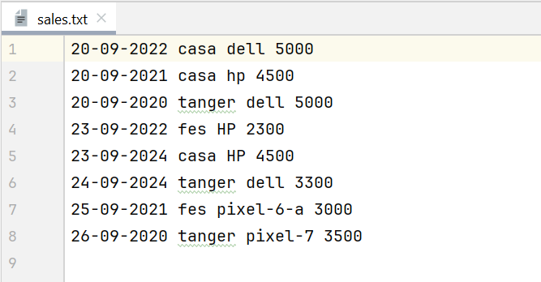


## SalesByCityConfig class

in order to structure and organize our code, we create this class that allow us
to get `SparkConf` instance for both cases: `local` and `remote or for cluster`, 
avoiding code duplication.


```java
package md.hajji.sales;

import org.apache.spark.SparkConf;

public class SalesByCityConfig {

    /**
     * create and initialize SparkConf for local use case
     * @param appName : the application name
     * @return : SparkConf instance
     */
    public static SparkConf localConf(String appName){
        return new SparkConf()
                .setAppName(appName)
                .setMaster("local[*]");
    }

    /**
     * create and initialize `SparkConf` for remote use case
     * @param appName : the application name
     * @return : SparkConf instance
     */
    public static SparkConf remoteConf(String appName){
        return new SparkConf()
                .setAppName(appName);
    }
}

```


## SalesByCityProcessing class


with the same raison of `SalesByCityConfig`, we create this class, 
because sales file processing, is almost the same for calculating 
total prices of sales by cities and sales by cities and year``


```java
package md.hajji.sales;

import org.apache.spark.broadcast.Broadcast;
import scala.Tuple2;
import java.time.LocalDate;
import java.time.format.DateTimeFormatter;

public class SalesByCityProcessing{

    /**
     * date formatter used in filter stage to cast:
     */
    private static final DateTimeFormatter FORMATTER =
            DateTimeFormatter.ofPattern("dd-MM-yyyy");


    /**
     * create pairs (tuples) for given line of file
     * @param line: the corresponding line in txt file
     * @return : A Pair of City as key and Price as value
     */
    public static Tuple2<String, Double> mapToCityPricePair(String line){
        String[] tokens = line.split(" ");
        return new Tuple2<>(tokens[1], Double.parseDouble(tokens[3]));
    }


    /**
     * Filter a record (line in txt file) by year:
     * @param line: the corresponding line in txt file
     * @param year: the year argument
     * @return : keep only line those matching the given year
     */
    public static boolean filterSalesByYear(String line, Broadcast<Integer> year) {
        return LocalDate
                .parse(line.split(" ")[0], FORMATTER)
                .getYear() == year.value();

    }


    /**
     * print Tuple details key and value:
     * @param tuple: A Pair of City and Price
     */
    public static void logResults(Tuple2<String, Double> tuple){
        System.out.println("City: " + tuple._1 + " ===>> Total Prices : " + tuple._2);
    }

}

```


## SalesByCityJobs class

we made this class for running jobs for both uses cases in different environments local or remote.

```java
package md.hajji.sales;

import org.apache.spark.SparkConf;
import org.apache.spark.api.java.JavaPairRDD;
import org.apache.spark.api.java.JavaSparkContext;
import org.apache.spark.broadcast.Broadcast;

public class SalesByCityJobs {

    /**
     * run a job for calculating total prices by city
     * @param conf : SparkConf instance
     * @param salesFileLocation : The location of sales.txt file
     */
    public static void run(SparkConf conf, String salesFileLocation) {
        // create JavaSparkContext instance:
        try (JavaSparkContext sparkContext = new JavaSparkContext(conf)){


            sparkContext.setLogLevel("WARN");

            // start performing actions:

            // read sales file:
            sparkContext.textFile(salesFileLocation)
                    // create Tuples city and prices:
                    .mapToPair(SalesByCityProcessing::mapToCityPricePair)
                    // calculate sum of prices by city:
                    .reduceByKey(Double::sum)
                    // collect results so the spark-master can collect results
                    // returned by workers:
                    .collect()
                    // print results:
                    .forEach(SalesByCityProcessing::logResults);

        }

    }

    /**
     * run a job for calculating total prices by city for a specific year
     * @param conf : SparkConf instance
     * @param salesFileLocation : The location of sales.txt file
     * @param year : year value
     */
    public static void run(SparkConf conf, String salesFileLocation, int year) {

        // open JavaSparkContext:
        try (JavaSparkContext sparkContext = new JavaSparkContext(conf)) {

            // set Log level:
            sparkContext.setLogLevel("WARN");

            // share year argument with workers:
            Broadcast<Integer> yearBroadcast = sparkContext.broadcast(year);

            // create Java Pai RDD with key is city
            // name and value is total price of sales:
            JavaPairRDD<String, Double> salesByCityAndYear =
                    // read sales file:
                    sparkContext.textFile(salesFileLocation)
                            // keep only record that match given year:
                            .filter(record ->
                                    SalesByCityProcessing.filterSalesByYear(record, yearBroadcast))
                            // create Pairs RDD:
                            .mapToPair(SalesByCityProcessing::mapToCityPricePair)
                            // sum prices by city name:
                            .reduceByKey(Double::sum);

            // if one or more record match given year:
            if (salesByCityAndYear.count() > 0){
                System.out.println("Total sales by city for year: " + year);
                salesByCityAndYear.collect()
                        .forEach(SalesByCityProcessing::logResults);
            }
            else
                System.out.println("No Result found for given year: " + year);

        }
    }
}

```


## Create and run spark jobs in local


### SalesByCity job

```java
package md.hajji.sales.local;

import md.hajji.sales.SalesByCityConfig;
import md.hajji.sales.SalesByCityJobs;
import org.apache.spark.SparkConf;


public class SalesByCity {

    private static final String APP_NAME = "local-sales-by-city";
    private static final String SALES_FILE_LOCATION = "sales.txt";

    public static void main(String[] args) {
        // load local configurations:
        SparkConf sparkConf = SalesByCityConfig.localConf(APP_NAME);

        // run job:
        SalesByCityJobs.run(sparkConf, SALES_FILE_LOCATION);
    }
}

```

#### Execution results

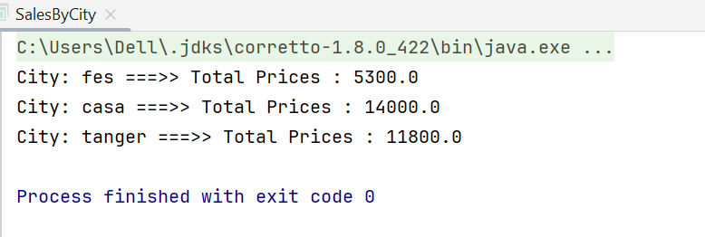


### SalesByCityAndYear job

```java
package md.hajji.sales.local;

import md.hajji.sales.SalesByCityConfig;
import md.hajji.sales.SalesByCityJobs;
import org.apache.spark.SparkConf;


public class SalesByCityAndYear {

    private static final String APP_NAME = "Sales-By-City-And-Year";
    private static final String SALES_FILE_LOCATION = "sales.txt";


    public static void main(String[] args) {

        // receive year argument:
        int year = Integer.parseInt(args[0]);
        //initialize spark configs:
        SparkConf sparkConf = SalesByCityConfig.localConf(APP_NAME);
        // run Job:
        SalesByCityJobs.run(sparkConf, SALES_FILE_LOCATION, year);

    }
}

```


#### Execution results

in order to pass `year argument` to main method of `SalesByCityAndYear` job, we should set up running configs:


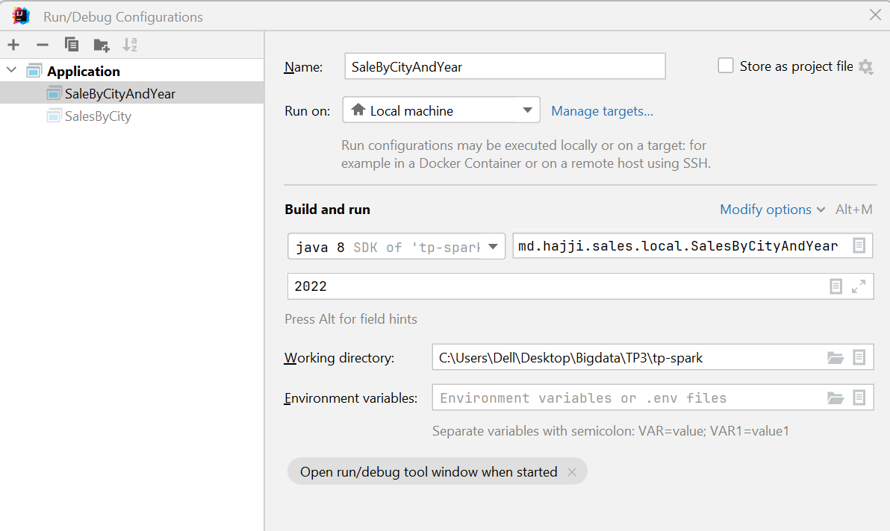


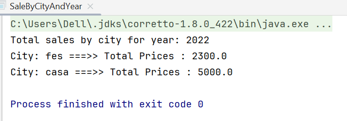


## Create and run spark jobs in spark-hdfs cluster

in this case we try to run the previous spark jobs `SalesByCity` and `SalesByCityAndYear`, 
in `spark-hdfs` cluster,
so the first step is to configure and start `Spark-HDFS` cluster in docker, and what will be changed in our previous programs
is `SALES_FILE_LOCATION` and `master url` (using `SalesByCityConfig.remoteConf(...)`).


### docker compose file


```yaml
services:
  # HDFS nodes:
  namenode:
    image: apache/hadoop:3.3.6
    container_name: namenode
    hostname: namenode
    command: ["hdfs", "namenode"]
    ports:
      - 9870:9870
    
    env_file:
      - ./config
    environment:
      ENSURE_NAMENODE_DIR: "/tmp/hadoop-root/dfs/name"
    volumes:
      - ./jars:/opt/hadoop/jars
      - ./shared:/opt/hadoop/shared
    networks:
      - spark-hdfs-net


  datanode:
    image: apache/hadoop:3.3.6
    command: ["hdfs", "datanode"]
    env_file:
      - ./config
    networks:
      - spark-hdfs-net


  resourcemanager:
    image: apache/hadoop:3.3.6
    hostname: resourcemanager
    container_name: resourcemanager
    command: ["yarn", "resourcemanager"]
    ports:
        - 8088:8088
    env_file:
      - ./config
    volumes:
      - ./test.sh:/opt/test.sh
    networks:
      - spark-hdfs-net

  nodemanager:
    image: apache/hadoop:3.3.6
    command: ["yarn", "nodemanager"]
    env_file:
      - ./config
    networks:
      - spark-hdfs-net
      
  
  # Spark nodes:

  spark-master:
    image: bitnami/spark:3.5.3-debian-12-r1
    container_name: spark-master
    hostname: spark-master
    environment:
      - SPARK_MODE=master
      - SPARK_MASTER_PORT=7077
      - SPARK_MASTER_WEBUI_PORT=8080
      - SPARK_DAEMON_MEMORY=1g 
    ports:
      - "7077:7077"
      - "8080:8080"
    volumes:
      - ./volumes/data:/data

    networks:
      - spark-hdfs-net


  spark-worker-1:
    image: bitnami/spark:3.5.3-debian-12-r1
    container_name: spark-worker-1
    environment:
      - SPARK_MODE=worker
      - SPARK_MASTER_URL=spark://spark-master:7077
      - SPARK_WORKER_MEMORY=1g  
      - SPARK_WORKER_WEBUI_PORT=4040
    depends_on:
      - spark-master
    volumes:
      - ./volumes/data:/data
    ports:
      - "4040:4040"  
    networks:
      - spark-hdfs-net

  spark-worker-2:
    image: bitnami/spark:3.5.3-debian-12-r1
    container_name: spark-worker-2
    environment:
      - SPARK_MODE=worker
      - SPARK_MASTER_URL=spark://spark-master:7077
      - SPARK_WORKER_MEMORY=1g 
      - SPARK_WORKER_WEBUI_PORT=4040
    depends_on:
      - spark-master
    volumes:
      - ./volumes/data:/data
    ports:
      - "4140:4040"  
    networks:
      - spark-hdfs-net


networks:
  spark-hdfs-net:
    driver: bridge

```


### Start Spark-HDFS cluster

in order to start `Spark-HDFS` cluster containing the all services described by `docker-compose.yml` file above, 
first we start docker `daiemon` by starting `docker engine` (in windows), then we run the following
command:

```shell
docker-compose up --scale datanode=3 -d
```


and the all services is started successfully:

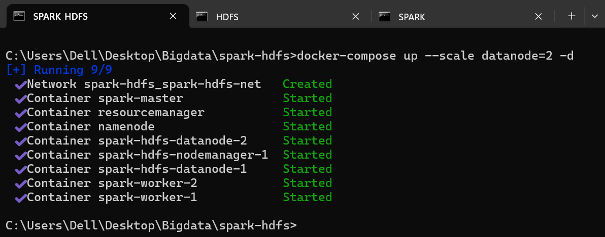


we check our running services using:

```shell
docker ps --format "{{.ID}} ------ {{.Names}}"
```

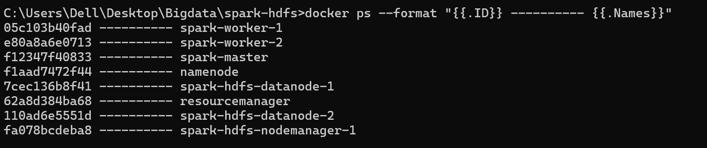


### Run spark jobs on spark-HDFS cluster

#### SalesByCity job

```java
package md.hajji.sales.remote;

import md.hajji.sales.SalesByCityConfig;
import md.hajji.sales.SalesByCityJobs;
import org.apache.spark.SparkConf;

public class SalesByCity {

    private static final String APP_NAME = "remote-sales-by-city";
    private static final String SALES_FILE_LOCATION = "hdfs://namenode:8020/input/sales.txt";

    public static void main(String[] args) {
        //load spark configs for remote:
        SparkConf sparkConf = SalesByCityConfig.remoteConf(APP_NAME);
        // run sales by city job:
        SalesByCityJobs.run(sparkConf, SALES_FILE_LOCATION);
    }
}

```


#### SalesByCityAndYear job

```java
package md.hajji.sales.remote;

import md.hajji.sales.SalesByCityConfig;
import md.hajji.sales.SalesByCityJobs;
import org.apache.spark.SparkConf;


public class SalesByCityAndYear {

    private static final String APP_NAME = "Sales-By-City-And-Year";
    private static final String SALES_FILE_LOCATION = "hdfs://namenode:8020/input/sales.txt";

    public static void main(String[] args) {

        // receive year argument:
        int year = Integer.parseInt(args[0]);

        //initialize spark configs:
        SparkConf sparkConf = SalesByCityConfig.remoteConf(APP_NAME);
        // run Job:
        SalesByCityJobs.run(sparkConf, SALES_FILE_LOCATION, year);
    }
}

```


the first steps to run our previous job in `spark-hdfs` cluster is to put `sales.txt` file into `HDFS` so 
spark jobs can easily access to that file for processing.


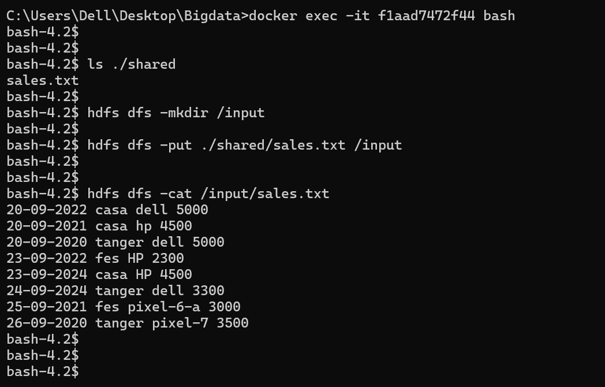

the second step is to generate our application jar file and put it somewhere in `spark-hdfs` cluster, by
placing it into `spark-master` volume.

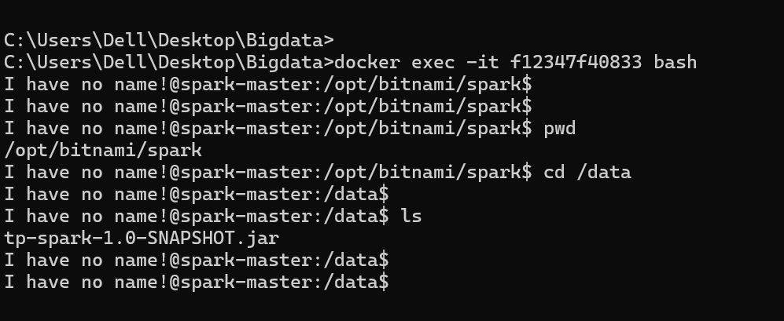


the latest step is to run our jobs using `spark-submit` command in `spark-master` container:

```shell
spark-submit --master spark://spark-master:7077 \
-- class md.hajji.sales.remote.SalesByCity \
tp-spark-1.0-SNAPSHOT.jar
```

and we got the following results:

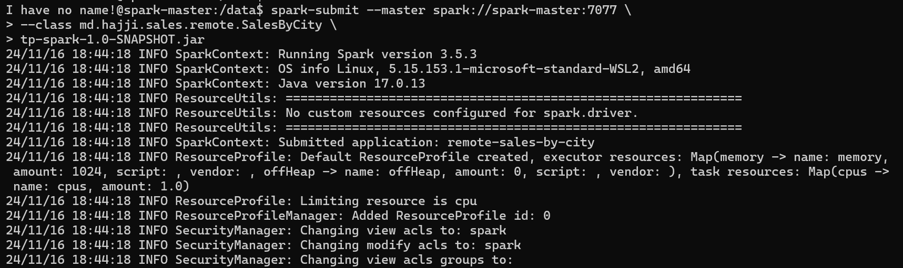

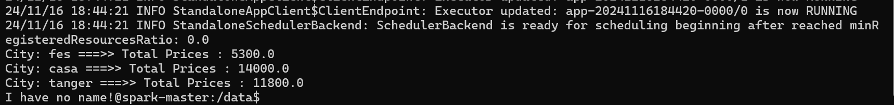

the same things for `SalesByCityAndYear` job:

```shell
spark-submit --master spark://spark-master:7077 \
-- class md.hajji.sales.remote.SalesByCity \
tp-spark-1.0-SNAPSHOT.jar \
2022
```


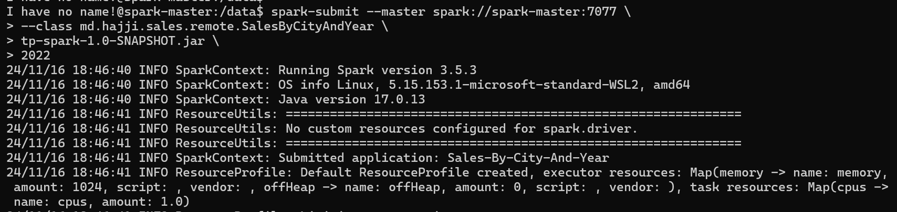

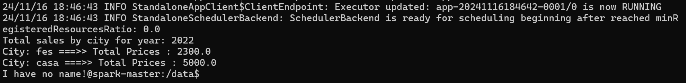
